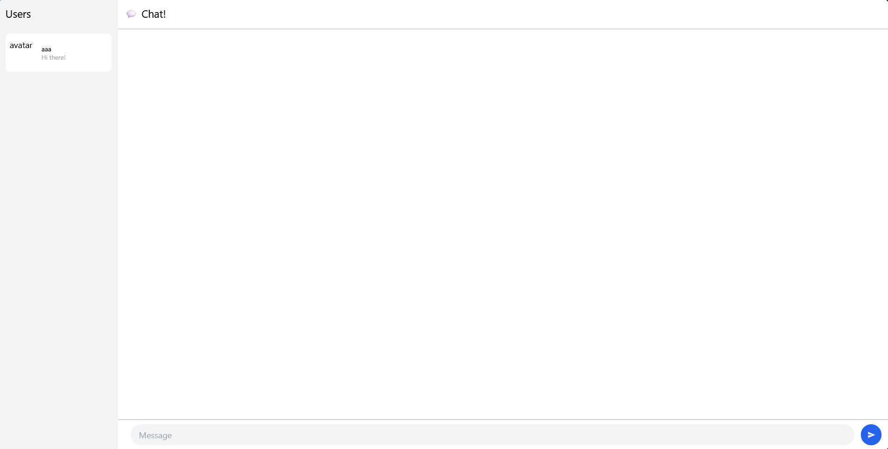
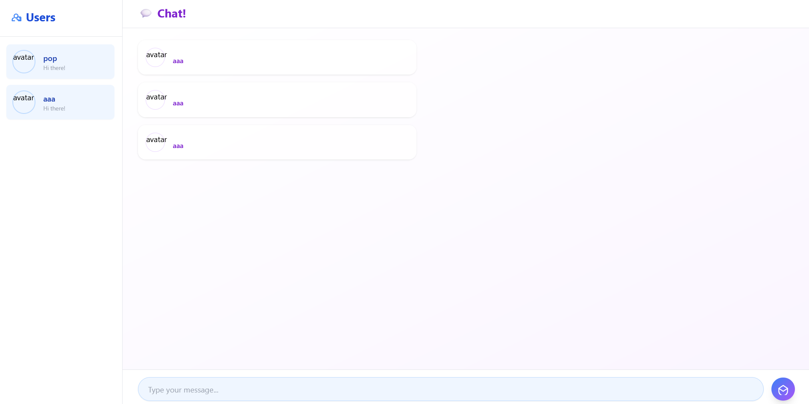

# YewChat 💬

> Source code for [Let’s Build a Websocket Chat Project With Rust and Yew 0.19 🦀](https://fsjohnny.medium.com/lets-build-a-websockets-project-with-rust-and-yew-0-19-60720367399f)

## Install

1. Install the required toolchain dependencies:
   ```npm i```

2. Follow the YewChat post!

## Branches

This repository is divided to branches that correspond to the blog post sections:

* main - The starter code.
* routing - The code at the end of the Routing section.
* components-part1 - The code at the end of the Components-Phase 1 section.
* websockets - The code at the end of the Hello Websockets! section.
* components-part2 - The code at the end of the Components-Phase 2 section.
* websockets-part2 - The code at the end of the WebSockets-Phase 2 section.

## 3.1 Original Code


## 3.2 Be Creative


Pada implementasi ini, saya menambahkan sentuhan visual dan interaktif yang modern untuk meningkatkan pengalaman pengguna dalam aplikasi chat berbasis Yew. Tampilan latar menggunakan gradasi warna dari biru muda ke ungu muda (bg-gradient-to-br from-blue-50 to-purple-100), menciptakan kesan segar dan menyenangkan. Sidebar daftar pengguna didesain elegan dengan latar putih, efek bayangan, serta menampilkan avatar bulat dari Dicebear disertai sapaan ramah. Di bagian utama, sistem chat bubble dibuat responsif berdasarkan pengirim pesan—pesan dari pengguna sendiri muncul di sisi kanan dengan warna biru muda, sementara pesan pengguna lain berada di sisi kiri dengan latar putih. Saya juga menambahkan fitur khusus yang menampilkan gambar jika pesan berformat .gif, serta menyisipkan konversi emotikon teks menjadi emoji asli agar percakapan terasa lebih ekspresif. Input form di bagian bawah diberi desain modern dengan border membulat, focus ring biru, dan tombol kirim berbentuk bulat dengan ikon panah untuk memberikan kesan intuitif dan ramah pengguna. Keseluruhan desain ini bertujuan menciptakan pengalaman yang estetis sekaligus humanis, menegaskan bahwa pengembangan aplikasi bukan hanya soal fungsi, tapi juga soal rasa dan interaksi yang menyenangkan.
